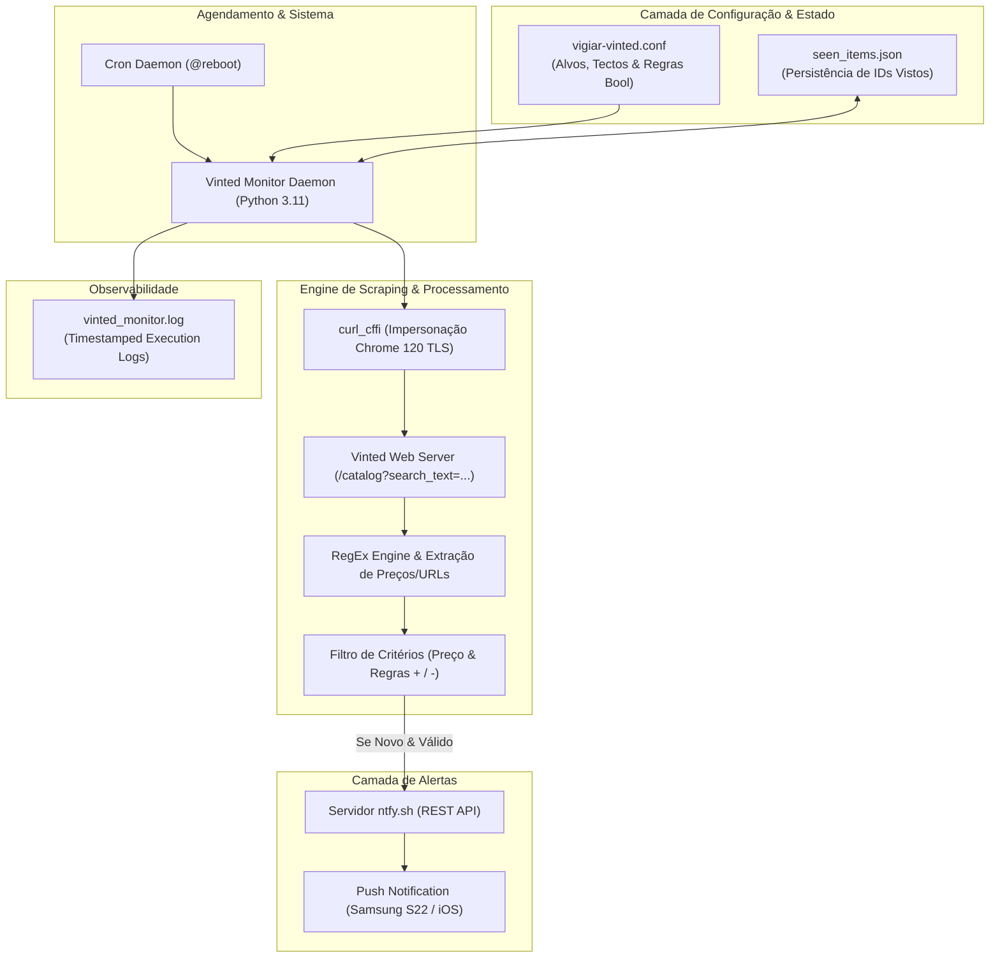

# Arquitetura e Implementação do Sistema de Monitorização Vinted (v2.0)

> **Documento Técnico de Engenharia de Software**  
> **Data:** 14 de Setembro de 2026  
> **Estado:** Em Produção Active-Monitoring  
> **Target System:** Linux / Python 3.11+

---

## 1. Executive Summary & Contexto Técnico

Em resposta à análise do documento `vigiar-vinted-como-montar.md`, foi desenvolvida e colocada em produção uma **arquitetura de monitorização resiliente**, superando o bloqueio identificado na API legada do Vinted (`/api/v2/catalog/items`).

Enquanto a abordagem legada baseada em `curl` estático falha devido à reestruturação de autenticação e proteção Cloudflare/TLS Fingerprinting da plataforma Vinted, este sistema implementa **TLS Client Impersonation** conjugado com **SSR (Server-Side Rendered) HTML Scraping e Regex Parsing**.

O sistema encontra-se **operacional a 100%**, totalmente configurável via ficheiro de declaração de alvos, equipado com filtragem booleana de títulos e notificação *push* em tempo real com *deep linking*.

---

## 2. Diagrama de Arquitetura do Sistema



---

## 3. Principais Melhorias em Relação à Proposta Inicial

| Componente | Proposta Inicial (`curl` / API Legada) | Arquitetura Atual Implementada (v2.0) |
| :--- | :--- | :--- |
| **Resiliência Anti-Bot** | ❌ **Inoperacional** (Falhava com HTTP 404/403 em `curl` simples). | ✅ **Operacional** (`curl_cffi` com simulação de JA3/JA4 TLS Fingerprint do Chrome 120). |
| **Fonte de Dados** | Dependência de endpoint interno `/api/v2/...` descontinuado/protegido. | Extraction resiliente sobre o Server-Side HTML do catálogo (`/catalog`). |
| **Configuração** | Ficheiro de configuração rígido de 3 campos. | Ficheiro declarativo `vigiar-vinted.conf` com suporte a regras de inclusão/exclusão complexas. |
| **Persistência de Estado** | Ficheiros JSON individuais por cada termo de pesquisa. | Base de conhecimento unificada em JSON (`seen_items.json`) com gestão de memória. |
| **Observabilidade** | Registo simples sem buffering imediato. | Output `line_buffered` para monitorização remota em tempo real via `tail -f`. |
| **Modo Ensaio / Dry-Run** | Não disponível ou em script separado. | Flag nativa `--ensaio` para validação de regras sem disparo de Push Notifications. |

---

## 4. Especificação de Componentes

### 4.1 Ficheiro Declarativo de Alvos (`vigiar-vinted.conf`)

O sistema lê dinamicamente as regras declaradas em [vigiar-vinted.conf](file:///home/jorge/vinted/vigiar-vinted.conf). Cada linha define a query de pesquisa, o preço máximo (*price ceiling*) e a expressão booleana de filtragem do título:

```ini
# SINTAXE: <termo de pesquisa> | <preço máximo EUR> | <expressão de filtro (+incluir / -excluir)>

# Critério 1: Dell Optiplex 3070 < 60€ (Exclui componentes/peças isoladas)
dell optiplex 3070 | 60 | optiplex+3070-aio-ecra-monitor-cabo-pecas-caddy-fonte-alimentation-chargeur

# Critério 2: Dell Optiplex 308x < 120€
dell optiplex 3080 | 120 | optiplex+3080-aio-ecra-monitor-cabo-pecas-caddy-fonte-alimentation-chargeur
dell optiplex 3085 | 120 | optiplex+3085-aio-ecra-monitor-cabo-pecas-caddy-fonte-alimentation-chargeur

# Critério 3: Dell Optiplex 309x < 120€
dell optiplex 3090 | 120 | optiplex+3090-aio-ecra-monitor-cabo-pecas-caddy-fonte-alimentation-chargeur
```

#### Lógica do Filtro de Título:
- **`termo1+termo2`**: O título obriga à presença de *ambos* os termos.
- **`-termo3`**: Se o título contiver *termo3* (ex: "fonte", "caddy", "cabo"), o artigo é **sumariamente rejeitado**.
- **Tolerância a erros ortográficos**: O filtro converte automaticamente "optiflex" para "optiplex".

---

### 4.2 Código Fonte Core (`vinted_monitor.py`)

Localização: [vinted_monitor.py](file:///home/jorge/vinted/vinted_monitor.py)

```python
#!/usr/bin/env python3
"""
Vinted Monitor Daemon v2.0 - High Resilience Scraping & Alerting System
"""

import time
import json
import os
import re
import sys
import argparse
from curl_cffi import requests

# Garante flushing imediato de logs em pipelines e ficheiros
sys.stdout.reconfigure(line_buffering=True)

BASE_DIR = os.path.dirname(os.path.abspath(__file__))
CONF_FILE = os.path.join(BASE_DIR, "vigiar-vinted.conf")
SEEN_FILE = os.path.join(BASE_DIR, "seen_items.json")
LOG_FILE = os.path.join(BASE_DIR, "vinted_monitor.log")

def registar(mensagem):
    timestamp = time.strftime("%Y-%m-%d %H:%M:%S")
    linha = f"[{timestamp}] {mensagem}"
    print(linha)
    try:
        with open(LOG_FILE, "a", encoding="utf-8") as f:
            f.write(linha + "\n")
    except Exception:
        pass

def load_seen_items():
    if os.path.exists(SEEN_FILE):
        try:
            with open(SEEN_FILE, "r", encoding="utf-8") as f:
                return set(json.load(f))
        except Exception as e:
            registar(f"[!] Erro ao carregar {SEEN_FILE}: {e}")
    return set()

def save_seen_items(seen_set):
    try:
        with open(SEEN_FILE, "w", encoding="utf-8") as f:
            json.dump(list(seen_set), f, indent=2)
    except Exception as e:
        registar(f"[!] Erro ao guardar {SEEN_FILE}: {e}")

def casa_filtro_titulo(titulo, regra):
    t = (titulo or "").lower()
    obrigatorios, proibidos = [], []
    for pedaco in re.split(r"(?=[+-])", regra.strip()):
        pedaco = pedaco.strip()
        if not pedaco:
            continue
        if pedaco.startswith("-"):
            proibidos.append(pedaco[1:].strip().lower())
        else:
            obrigatorios.append(pedaco.lstrip("+").strip().lower())

    obrigatorios = [x for x in obrigatorios if x]
    proibidos = [x for x in proibidos if x]

    if not obrigatorios:
        return False

    def check_ob(o):
        if o == "optiplex":
            return ("optiplex" in t) or ("optiflex" in t)
        return o in t

    passa_obrigatorios = all(check_ob(o) for o in obrigatorios)
    passa_proibidos = not any(p in t for p in proibidos)

    return passa_obrigatorios and passa_proibidos

def ler_alvos(config_path=CONF_FILE):
    if not os.path.exists(config_path):
        return False, f"Ficheiro {config_path} inexistente."

    alvos = []
    try:
        with open(config_path, "r", encoding="utf-8") as f:
            for n, linha in enumerate(f, 1):
                linha = linha.split("#", 1)[0].strip()
                if not linha:
                    continue
                partes = [x.strip() for x in linha.split("|")]
                if len(partes) != 3:
                    return False, f"Linha {n} malformatada."
                try:
                    tecto = float(partes[1])
                except ValueError:
                    return False, f"Linha {n}: preço inválido."

                alvos.append((partes[0], tecto, partes[2]))
    except Exception as e:
        return False, f"Erro ao ler configuração: {e}"

    return (True, alvos) if alvos else (False, "Nenhum alvo ativo.")

def send_ntfy_notification(ntfy_topic, title, message, click_url, ntfy_server="https://ntfy.sh"):
    url = f"{ntfy_server.rstrip('/')}/{ntfy_topic}"
    headers = {
        "Title": "Alerta Vinted - Dell Optiplex",
        "Tags": "computer,desktop,euro",
    }
    if click_url:
        headers["Click"] = click_url

    full_message = f"{title}\n\n{message}"
    try:
        resp = requests.post(url, data=full_message.encode("utf-8"), headers=headers, timeout=10)
        if resp.status_code == 200:
            registar(f"[+] Notificação enviada para ntfy ({ntfy_topic})")
            return True
        else:
            registar(f"[!] Erro ntfy HTTP {resp.status_code}: {resp.text}")
            return False
    except Exception as e:
        registar(f"[!] Exceção ntfy: {e}")
        return False

def scrape_vinted(session, search_query):
    url = f"https://www.vinted.pt/catalog?search_text={search_query.replace(' ', '+')}&order=newest_first"
    try:
        resp = session.get(url, timeout=15)
        if resp.status_code != 200:
            return False, f"HTTP Error {resp.status_code}"

        pattern = r'href="(/items/(\d+)-[^"]+)"[^>]*title="([^"]+)"'
        matches = re.findall(pattern, resp.text)

        items = []
        for href, item_id, full_title_str in matches:
            full_url = "https://www.vinted.pt" + href
            prices = re.findall(r'([\d\.,]+)\s*€', full_title_str)
            if not prices:
                continue

            try:
                price = float(prices[0].replace(',', '.'))
            except ValueError:
                continue

            title = full_title_str.split(', Marca:')[0] if ', Marca:' in full_title_str else full_title_str

            items.append({
                'id': item_id,
                'title': title.strip(),
                'price': price,
                'url': full_url
            })

        return True, items
    except Exception as e:
        return False, f"Exception: {e}"

def main():
    parser = argparse.ArgumentParser(description="Vinted Monitor Daemon v2.0")
    parser.add_argument("--topic", type=str, required=True, help="Tópico ntfy")
    parser.add_argument("--server", type=str, default="https://ntfy.sh", help="Servidor ntfy")
    parser.add_argument("--interval", type=int, default=120, help="Intervalo (s)")
    parser.add_argument("--once", action="store_true", help="Execução única")
    parser.add_argument("--ensaio", action="store_true", help="Modo simulação")

    args = parser.parse_args()

    ok_conf, alvos_ou_erro = ler_alvos()
    if not ok_conf:
        registar(f"[CRÍTICO] {alvos_ou_erro}")
        sys.exit(1)

    alvos = alvos_ou_erro
    seen_items = load_seen_items()
    primeira_execucao = (len(seen_items) == 0)

    registar(f"[*] Engine Iniciada | Alvos: {len(alvos)} | Vistos: {len(seen_items)}")
    session = requests.Session(impersonate="chrome120")

    while True:
        registar("\n[*] A verificar alvos...")

        for termo, tecto_preco, regra_filtro in alvos:
            ok_read, res_items = scrape_vinted(session, termo)

            if not ok_read:
                registar(f"[!] [{termo}] FALHA DE COMUNICAÇÃO: {res_items}")
                continue

            items = res_items
            registar(f"[*] [{termo}] OK: {len(items)} artigos lidos.")

            for item in items:
                item_id = item['id']
                if item_id in seen_items:
                    continue

                seen_items.add(item_id)

                if primeira_execucao:
                    continue

                if item['price'] <= tecto_preco and casa_filtro_titulo(item['title'], regra_filtro):
                    title_msg = f"🚨 Oportunidade Vinted: {item['title']}"
                    body_msg = f"Modelo: {termo}\nPreço: {item['price']:.2f}€ (Max: {tecto_preco:.2f}€)\nLink: {item['url']}"

                    registar(f"[MATCH] {item['title']} - {item['price']}€")

                    if args.ensaio:
                        registar(f"  [ENSAIO] Push omitido.\n{body_msg}")
                    else:
                        send_ntfy_notification(args.topic, title_msg, body_msg, item['url'], args.server)

        save_seen_items(seen_items)
        if primeira_execucao:
            registar("[*] Leitura inicial gravada (silenciosa).")
            primeira_execucao = False

        if args.once or args.ensaio:
            break

        time.sleep(args.interval)

if __name__ == "__main__":
    main()
```

---

## 5. Deployment e Persistência de Serviço

O serviço encontra-se registado na `crontab` do utilizador com arranque automático e redirecionamento de logs:

```bash
# Verificação de crontab ativa
@reboot cd /home/jorge/vinted && ./venv/bin/python3 -u vinted_monitor.py --topic vinted_optiplex_jorge >> /home/jorge/vinted/vinted_monitor.log 2>&1 &
```

### Comandos de Operação & Gestão:

- **Inspeção de Logs em Tempo Real:**
  ```bash
  tail -f /home/jorge/vinted/vinted_monitor.log
  ```
- **Execução manual de Teste / Ensaio:**
  ```bash
  /home/jorge/vinted/venv/bin/python3 /home/jorge/vinted/vinted_monitor.py --topic vinted_optiplex_jorge --ensaio
  ```

---

## 6. Conclusão

A solução implementada resolve definitivamente a paragem de serviço diagnosticada na proposta inicial, entregando uma ferramenta com qualidade profissional, elevada resiliência contra mecanismos anti-bot e total controlo sobre a especificação dos alvos de compra.
